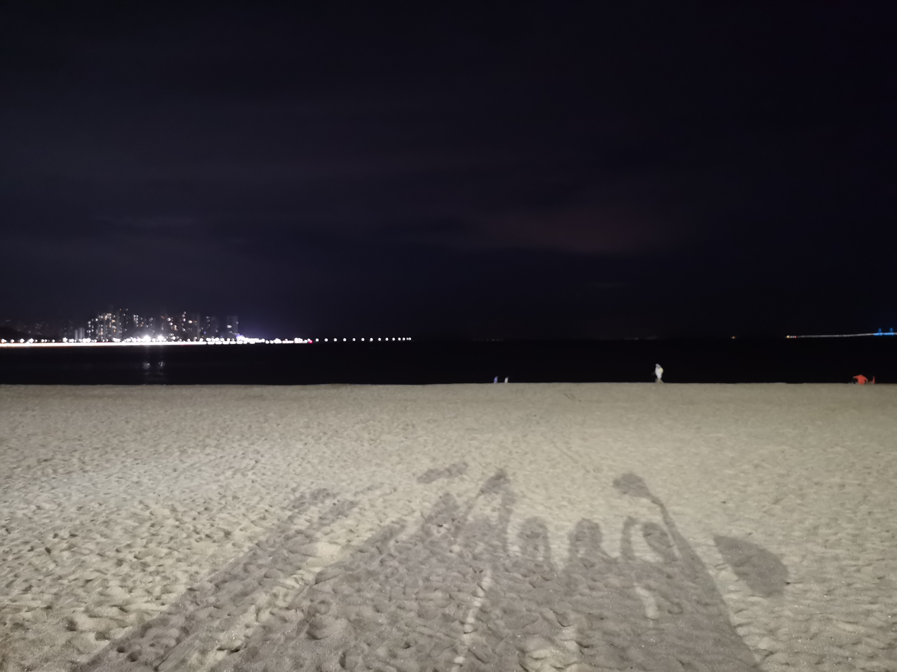
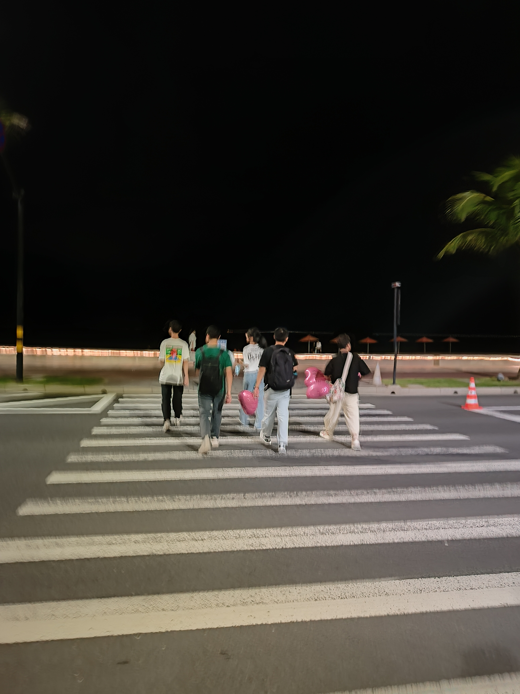
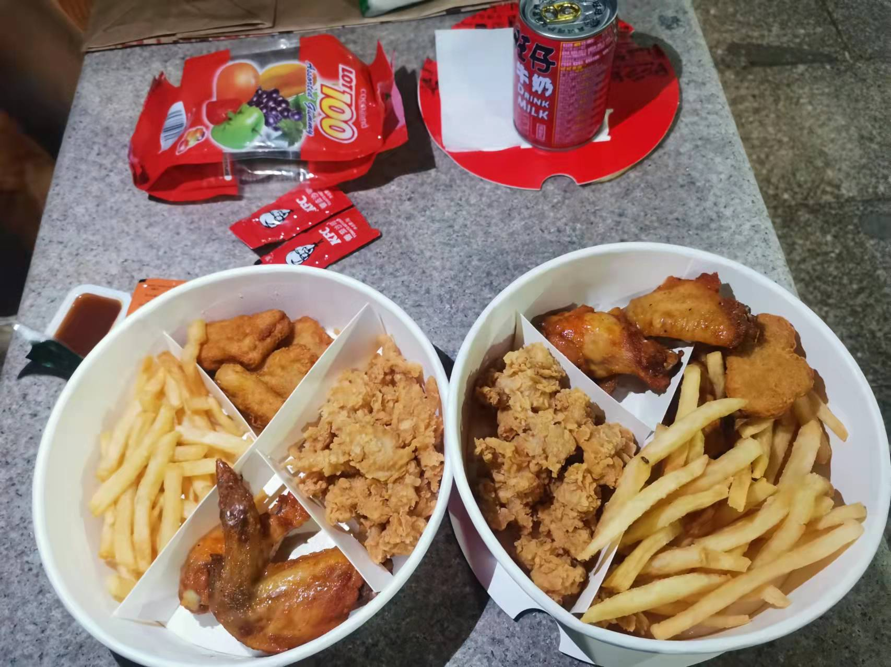

# 𝗛𝗲𝗹𝗹𝗼 𝗜'𝗺 Cai wj

𝓘 ❤️ 𝖆𝖒 𝖆𝖓 𝖚𝖓𝖉𝖊𝖗𝖌𝖗𝖆𝖉𝖚𝖆𝖙𝖊 𝖘𝖙𝖚𝖉𝖊𝖓𝖙

:computer:𝕴'𝖒 𝖙𝖗𝖞𝖎𝖓𝖌 𝖙𝖔 𝖑𝖊𝖆𝖗𝖓 𝕴𝕿 𝖙𝖊𝖈𝖍𝖓𝖔𝖑𝖔𝖌𝖞

## 📷 Memory

    

		
    

    

        
    

    

        
    

    

        
    

 

&nbsp;

&nbsp;

&nbsp;

## 📜 Personal

- Personal website and blog: [https://blog.csdn.net/Dueser](https://blog.csdn.net/Dueser)
- e-mail: cxm71701@gmail.com

